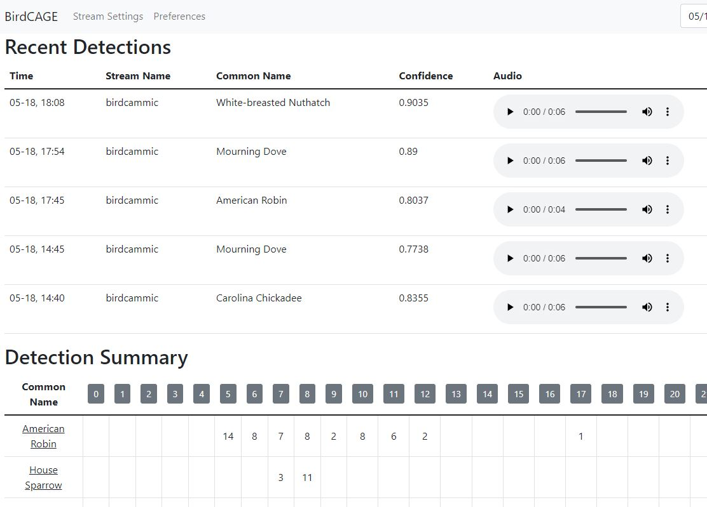

# Newest stuff
(listed newest first)
- I made the authentication process for changing settings less kludgey. The default password remains "birdcage". The user
name is "admin". This required adding yet another environment variable to the docker-compose so you'll need to update again
- I think I've fixed the issue with multiple cameras not working. The problem was that there were not enough worker
processes being created. By default there are now 10 worker processes being created. This can be controlled with the
CONCURRENCY environment variable in the docker-compose file. You need at least (1 per stream) plus... uh... 2 maybe. I'm
not sure how they get assigned. 1 task gets spun up per stream plus one for analysis, and these run forever. There's another
task that gets executed once a week for updating the birds-of-the-week list. So at least 1 per stream plus 2, and add on 
another if that doesn't work.
- I pushed an image of the BirdNET-Analyzer including my patches. The docker-compose file now refers to that image, so installation
should be more straightforward.

# BirdCAGE
BirdCAGE is an application for monitoring the bird songs in audio streams. Security cameras often provide
rtsp and rtmp streams that contain both video and audio. Feed the audio into BirdCAGE and see what sorts of birds are hanging around.

BirdCAGE was strongly inspired by BirdNET-Pi, but with the constraints of running in a Rasberry Pi removed. It utilizes
a slightly patched version of the analysis server provided by the BirdNET-Analyzer project. 

BirdCAGE is written in Python and was designed to be containerizable. It utilizes a separate back end and front end application.
The back end application records streams, calls the analysis server, stores results, and serves as an API server for the front end
application. The front end provides the UI. The back end application uses celery to spin up separate tasks for stream recording
and analyzing and analysis. A Redis container is used to coordinate the tasks.

## Here's what you're gonna do
- Assuming you are using docker-compose, create a new directory on your server for the application. Put the docker-compose.yml
file from this repo in there. Create detections and db directories in there as well.
- Edit the docker-compose.yml file to meet your needs.
    - If you just want to view the UI from your intranet via IP addresses,
all you should have to do is replace 192.168.1.75 (in 3 places) with the IP address of your server.
    - If you want to be able to access it
from the internet, use your reverse proxy to give names to both the front end and back end (birdcage.yourdomain.com and
birdcageapi.yourdomain.com). Add the front end url to CORS_ORIGINS (e.g. CORS_ORIGINS: http://192.168.1.75:7008,http://birdcage.yourdomain.com)
and use back end name for API_SERVER_URL (e.g. API_SERVER_URL: http://birdcageapi.yourdomain.com).
    - ANALYZE_SERVER should the IP address of your server, and ANALYZE_PORT should be the port that is being mapped. 
to 8080 in the birdnetserver service section. (In theory interactions with the birdnetserver could all be on the virtual 
network. I need to try that out. For now, use a LAN address)
- docker-compose up
- From the Web UI go to Stream Settings and add a stream. The user name is 'admin and default password is 'birdcage'. 
The Name field is for however you want the stream identified in the
UI. Address is the full url of the stream from your source (try opening it in VLC to make sure it works if you aren't sure).
Protocol is http, rtmp, or rtsp. Transport is TCP or UDP. This is only important for rtsp because it can use either one.
- Go to Preferences and set your latitude and longitude and tweak other settings. The default password is 'birdcage'. 
If you live in Topeka, Kansas you are
in luck: your latitude and longitude are already set.
- Consider changing the default password. Or don't.
- Did the above not work?
    - See if you can go to whatever you set as your API_SERVER_URL in your browser. You should see a (very incomplete) UI of API documentation.
    If not, the back end / API server is not exposed to the network correctly or the docket-compose file isn't configured correctly. Or both.
    - If that works, go back to the Preferences page, hit F12 and see if there are any client side scripting errors. All of the API
    calls are done in client side scriping in the browser to keep things snappy. If you are accessing the Web UI through a name via a reverse
    proxy, that name needs to be added to the CORS_ORIGINS environment variable in docker-compose.yml, you need to set a name for the back end/API server, and that name
    needs to be specified in the API_SERVER_URL environment variable in docker-compose.yml.
- Kill the BirdCAGE application (control C or docker-compose down). I don't have nice way to start recording from new streams yet.
- docker-compose up one more time. It should now start recording and analyzing

This is early days. Chances are things will break. Let me know what's broke in the Discussions or in an Issue or an angry
letter or whatever.

## To Do
- Add more features, e.g. block storing recordings of selected species. I don't need any more recordings of Robins.
- Handle changing streams and preferences without having to kill the app.
- I'm planning to work on a "sattelite recorder" based on the ESP32 platform. It'll probably need a different interface to upload audio
to avoid interference between the audio and WiFi.
